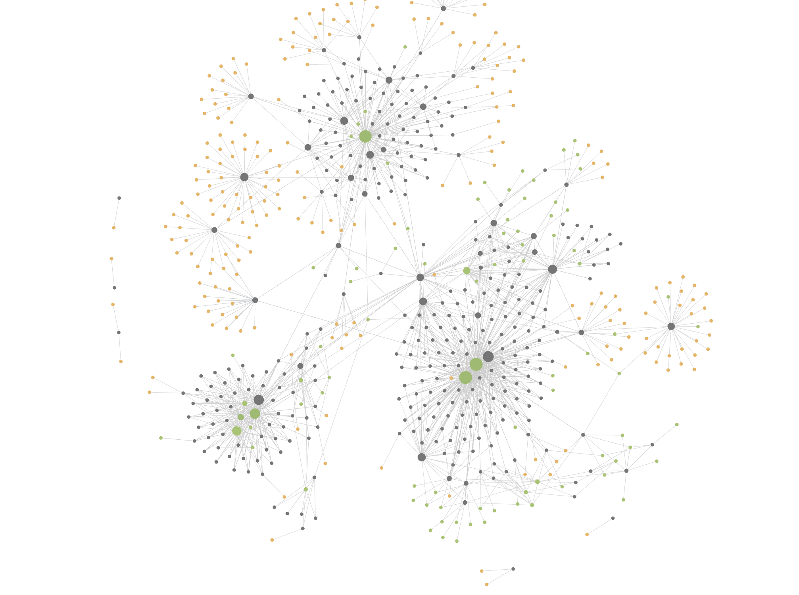

English | [中文](README_ZH.md)

# llm-wiki-stack

[](https://www.npmjs.com/package/llm-wiki-stack)
[](https://www.npmjs.com/package/llm-wiki-stack)
[](LICENSE)

---

## Why I Built This

Every time I save a new article, a question flashes through my mind: when will I open this again?

If I really need it someday, will I remember that I put it here? That brief hesitation can feel a little discouraging, because I am not sure whether all this saving, clipping, and organizing will ever turn into something valuable.

So when I first saw Karpathy's LLM Wiki idea, my immediate reaction was to use it for personal knowledge management.

To be clear, this framework is not for every scenario. It is not the most efficient retrieval system, and it is not meant to handle large-scale enterprise databases or academic literature search. For those use cases, RAG is usually the better answer. But personal knowledge management is different.

My goal is not to find one answer as fast as possible. It is to let the articles, notes, and thoughts I have read over time connect into lines, and gradually build my own understanding of a topic.

Raw information should not just sit quietly in a folder, waiting to be accidentally used one day. In a better state, **it keeps forming new connections and slowly deepens your understanding of a subject.**

llm-wiki-stack does not solve the challenge of collecting or searching. It offers a direction for synthesis.

## Who This Is For

- People who often save articles, podcasts, interviews, and reports, but rarely reuse them
- People who manage personal knowledge with Obsidian, Markdown, or plain folders
- People who want reading material to become a concept network, not just full-text search results
- People who want LLMs to organize, link, and inspect their notes, while keeping final judgment for themselves

It is not for people who need enterprise-scale retrieval, and it is not a full GUI product. It is closer to a lightweight workflow: folders, Markdown, Obsidian, and a few LLM commands.

## Quick Start

```bash
npx llm-wiki-stack
```

This installs four commands into `~/.claude/skills/`. Then open Claude Code in your Obsidian vault:

1. **Once**: `/kb-init` — initialize the three-layer knowledge base structure
2. **Often**: `/wiki-compile` — compile new raw notes into wiki concept pages
3. **When curious**: `/wiki-topic` — ask a question and generate structured analysis from your own notes
4. **Every so often**: `/wiki-lint` — run a knowledge-base health check: broken links, orphan concepts, fragile dependencies, concept evolution

Try these four actions. You will know quickly whether this is for you.

## How It Works

Think of it as a **compiler** for knowledge: raw source material goes in, a structured concept network comes out.

After running for a while, what grows is not a list of articles in a folder, but an expandable concept network:



```
01 raw/   ──compile──>  02 wiki/   ──dialogue──>  03 outputs/
(source notes)          (concept network)           (your opinions)
```

Each layer has a clear role:

| Layer | Owned by | What happens |
|-------|----------|--------------|
| `01 raw/` | **You** | Save articles, clippings, and thoughts. The LLM reads the body text but does not rewrite it. |
| `02 wiki/` | **LLM** | Extracts entities and concepts, tracks how your understanding evolves, and builds bidirectional links. |
| `03 outputs/` | **You + LLM** | You ask questions. The LLM reveals structural relationships. You write the conclusion. |

The result: every concept has a page, every page links to its sources, every source is traceable, and every change in understanding is recorded.

## A Real Workflow

You put a dozen articles about "long-termism" into `01 raw/`.

After you run `/wiki-compile`, the system does not merely summarize them. It extracts entities and concept pages such as "delayed gratification", "compound interest", "path dependence", and "identity narrative", then links them back to the original sources.

A few weeks later, you ask `/wiki-topic`:

> When does long-termism become self-deception?

The system finds tensions, conflicts, and analogies across your own material, then generates a structured analysis. The final judgment is still yours to write.

That is the value of this system: past material is no longer only saved. It participates in thinking again.

## Commands

| Command | Role | Action |
|---------|------|--------|
| `/kb-init` | Architect | Initialize the three-layer structure, generate `AGENTS.md`, and compile existing raw notes. |
| `/wiki-compile` | Compiler | Extract entities and concepts from new raw notes, check index boundaries, and build cross-references. |
| `/wiki-topic` | Analyst | Question-driven synthesis: reveal causal chains, tensions, analogies, and synthetic hypotheses. |
| `/wiki-lint` | Inspector | Health check: broken links, orphan pages, fragile dependencies, and concept evolution. |

## The Mechanisms That Make It Work

### Index Boundaries: Definability + Connection Strength

The first version of this project did not look complicated. I built the initial system in one morning, because at its core it is just a skill. The part that actually took time was figuring out how to make the model build useful indexes.

At first, I almost completely trusted the model and let it create indexes freely. The result quickly became obvious: many generated concepts were hard to reuse, and a lot of source material was left outside the index.

The debugging process went through a cycle of expansion and contraction. My first instinct was to add a rule whenever I found a problem. Then the rules kept growing, but the system did not become more stable. After many revisions, I realized that path had no end, so I started over and re-examined the indexing logic from the goal itself.

In the end, I reduced the index standard to two questions:

- **Definability**: does this index have a clear, stable, unambiguous definition? This prevents overgeneralized indexes and concepts that swallow too many unrelated things.
- **Connection strength**: how many raw sources can this index connect? This prevents one-off concepts that only serve a single article and cannot be reused later.

In practice, every new concept has to earn its page: it must be clearly definable, have a single core, and be supported by multiple sources. More subjective judgments, such as index health, content depth, and topic potential, are left to `/wiki-lint` as suggestions. The model can advise, but it does not decide for you whether an index should exist.

### Concept Evolution: Never Overwrite

New information appends by default. Core definitions change only when new evidence **explicitly corrects** an old factual error. When that happens, the old understanding is archived in the "Concept Evolution" section with time and source.

Conflicting perspectives are not forcibly merged. They are recorded side by side in "Different Perspectives". Your intellectual history is preserved, not erased.

### Cross-Reference Integrity

Every key claim links to a raw source. Every wiki link stays bidirectional. Each compile verifies `linked_count`, and broken links or orphan concepts surface in the health report.

There is no hidden state and no black-box database. Everything is a Markdown file with YAML frontmatter.

### Human Judges, LLM Compiles

The LLM organizes, links, completes metadata, and finds structural problems. You handle judgment, tradeoffs, follow-up questions, and final opinions.

This is also why I deliberately did not design a GUI. On one hand, Obsidian is already a natural visualization layer. On the other hand, even if you do not use Obsidian, this system still works with folders and Markdown.

For a personal knowledge base, the most important thing is the content itself, not the interface. Folders are still the most free and flexible form. You can keep modifying this version until it fits your own product shape.

## Closing

In his Stanford commencement speech, Jobs talked about more than "stay hungry, stay foolish". He also talked about connecting the dots. I like that idea a lot. He compared life experiences to a series of dots whose connections can only be seen when looking backward. Each of us keeps collecting these dots: articles we read, talks we hear, events we experience, thoughts we have. They sit scattered in memory, or saved somewhere in a folder, but their real value comes from the connections between them.

I hope this system can help you connect those scattered pieces of understanding from your own journey, so your past can nourish your future.

## Requirements

- [Claude Code](https://docs.anthropic.com/en/docs/claude-code) or a compatible AI coding assistant
- [Obsidian](https://obsidian.md/) (recommended, because graph view makes the concept network visible)

## License

MIT. Free forever.

---

*Inspired by [Karpathy's llm-wiki](https://gist.github.com/karpathy/442a6bf555914893e9891c11519de94f) concept.*
